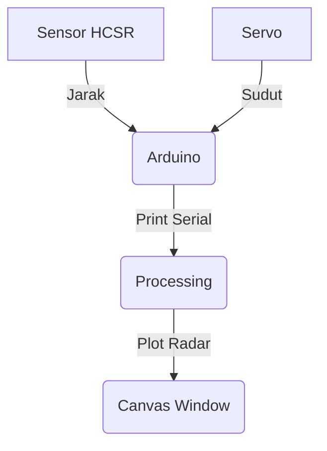

# Project Pemetaan 2D Berbasis Arduino Uno dengan Sensor HCSR-04

> [!NOTE]  
>  Project ini bertujuan untuk melakukan pemetaan 2D menggunakan Arduino Uno sebagai mikrokontroller dengan sensor HCSR-04 yang akan mendeteksi objek lalu dipetakan ke dalam LCD I2C 128x64.

## Daftar Isi

<details>
<summary> Buka </summary>
    
- [Diargam Rangkaian](https://github.com/FillahAlamsyah/Project-Radar/blob/main/README.md#cDiargam-Rangkaian)
- [Cara Kerja](https://github.com/FillahAlamsyah/Project-Radar/blob/main/README.md#cara-kerja)
- [Kode Arduino](https://github.com/FillahAlamsyah/Project-Radar/blob/main/README.md#kode-arduino)
- [Kode Processing](https://github.com/FillahAlamsyah/Project-Radar/blob/main/README.md#kode-processing)
- [Referensi](https://github.com/FillahAlamsyah/Project-Radar/blob/main/README.md#Referensi)

</details>

## Diargam Rangkaian

<details>
<summary> Buka </summary>


[Simulasi Rangkaian di wokwi.com](https://wokwi.com/projects/376864616405893121)

</details>

## Cara Kerja

<details>
<summary> Buka </summary>
    



* Output 

Test di P5JS Web Live Editor https://editor.p5js.org/fillahall/sketches/RXj1kirjl

</details>

## Kode Arduino

<details>
<summary> Buka </summary>
    
```c++
#include <Servo.h> 

// Defines Trig and Echo pins of the Ultrasonic Sensor
const int trigPin = 10;
const int echoPin = 11;
const int servoPin = 12;
// Variables for the duration and the distance
long duration;
int distance;

Servo myServo; // Creates a servo object for controlling the servo motor

void setup() {
  Serial.begin(9600);
  pinMode(trigPin, OUTPUT); // Sets the trigPin as an Output
  pinMode(echoPin, INPUT); // Sets the echoPin as an Input
  myServo.attach(servoPin); // Defines on which pin is the servo motor attached
}
void loop() {
  for(int i=15;i<=165;i++){ // rotates the servo motor from 15 to 165 degrees
    myServo.write(i);
    delay(30);
    distance = calculateDistance(); // Calls a function for calculating the distance measured by the Ultrasonic sensor for each degree
    Serial.print(i);Serial.print(",");Serial.println(distance);
  }
  for(int i=165;i>15;i--){  // Repeats the previous lines from 165 to 15 degrees
    myServo.write(i);
    delay(30);
    distance = calculateDistance();
    Serial.print(i);Serial.print(",");Serial.println(distance);
  }
}
// Function for calculating the distance measured by the Ultrasonic sensor
int calculateDistance(){ 
  digitalWrite(trigPin, LOW); 
  delayMicroseconds(2);
  digitalWrite(trigPin, HIGH);  // Sets the trigPin on HIGH state for 10 micro seconds
  delayMicroseconds(10);
  digitalWrite(trigPin, LOW);
  duration = pulseIn(echoPin, HIGH); // Reads the echoPin, returns the sound wave travel time in microseconds
  distance = duration*0.034/2;
  return distance;
}
```
</details>

## Kode Processing
<details>
<summary> Buka </summary>
    
### Header
```java
import processing.serial.*; // imports library for serial communication
import java.awt.event.KeyEvent; // imports library for reading the data from the serial port
import java.io.IOException;
```

### Variabel
```java
Serial myPort; // defines Object Serial

// defines variables
String angle="";
String distance="";
String data="";
String noObject;
float pixsDistance;
int iAngle, iDistance;
int index1=0;
int index2=0;

String[] parts;
PFont orcFont;
```
### Fungsi ```setup()```
```java
void setup() {
 size (1200, 700); // ***CHANGE THIS TO YOUR SCREEN RESOLUTION***
 smooth();
 String portName = Serial.list()[0]; //change the 0 to a 1 or 2 etc. to match your port
 myPort = new Serial(this,portName, 9600); // ****CHANGE THE COM3 To the PORT YOUR ARDUINO IS ON!!!!****
 println(myPort);
 myPort.bufferUntil('\n'); // reads the data from the serial port up to the character '.'. So actually it reads this: angle,distance.
}
```
### Fungsi ```draw()```
```java
void draw() {
  fill(98,245,31);// simulating motion blur and slow fade of the moving line
  noStroke();
  fill(0,4); 
  rect(0, 0, width, height-height*0.065); 
  
  fill(98,245,31); // green color
  // calls the functions for drawing the radar
  drawRadar(); 
  drawLine();
  drawObject();
  drawText();
}
```

### Fungsi ```serialEvent()```
```java
void serialEvent (Serial myPort) { // starts reading data from the Serial Port
  // reads the data from the Serial Port up to the character '.' and puts it into the String variable "data".
  try{
  data = myPort.readStringUntil('\n');
  println(data);
  parts = data.split(",");
  angle = parts[0].trim();
  distance = parts[1].trim();
  println("angle : ", angle,"\t distance : ",distance);
  // converts the String variables into Integer
  iAngle = int(angle);
  iDistance = int(distance);
  }
  catch(Exception e){
    e.printStackTrace();
  }
}
```

### Fungsi ```drawRadar()```
```java
void drawRadar() {
  pushMatrix();
  translate(width/2,height-height*0.074); // moves the starting coordinats to new location
  noFill();
  strokeWeight(2);
  stroke(98,245,31);
  // draws the arc lines
  arc(0,0,(width-width*0.0625),(width-width*0.0625),PI,TWO_PI);
  arc(0,0,(width-width*0.27),(width-width*0.27),PI,TWO_PI);
  arc(0,0,(width-width*0.479),(width-width*0.479),PI,TWO_PI);
  arc(0,0,(width-width*0.687),(width-width*0.687),PI,TWO_PI);
  // draws the angle lines
  line(-width/2,0,width/2,0);
  line(0,0,(-width/2)*cos(radians(30)),(-width/2)*sin(radians(30)));
  line(0,0,(-width/2)*cos(radians(60)),(-width/2)*sin(radians(60)));
  line(0,0,(-width/2)*cos(radians(90)),(-width/2)*sin(radians(90)));
  line(0,0,(-width/2)*cos(radians(120)),(-width/2)*sin(radians(120)));
  line(0,0,(-width/2)*cos(radians(150)),(-width/2)*sin(radians(150)));
  line((-width/2)*cos(radians(30)),0,width/2,0);
  popMatrix();
}
```
Output


### Fungsi ```drawObject()```
```java
void drawObject() {
  pushMatrix();
  translate(width/2,height-height*0.074); // moves the starting coordinats to new location
  strokeWeight(9);
  stroke(255,10,10); // red color
  pixsDistance = iDistance*((height-height*0.1666)*0.025); // covers the distance from the sensor from cm to pixels
  // limiting the range to 40 cms
  if(iDistance<40){
    // draws the object according to the angle and the distance
  line(pixsDistance*cos(radians(iAngle)),-pixsDistance*sin(radians(iAngle)),(width-width*0.505)*cos(radians(iAngle)),-(width-width*0.505)*sin(radians(iAngle)));
  }
  popMatrix();
}
```


### Fungsi ```drawLine()```
```java
void drawLine() {
  pushMatrix();
  strokeWeight(9);
  stroke(30,250,60);
  translate(width/2,height-height*0.074); // moves the starting coordinats to new location
  line(0,0,(height-height*0.12)*cos(radians(iAngle)),-(height-height*0.12)*sin(radians(iAngle))); // draws the line according to the angle
  popMatrix();
}
```


### Fungsi ```drawText()```
```java
void drawText() { // draws the texts on the screen
  
  pushMatrix();
  if(iDistance>40) {
  noObject = "Out of Range";
  }
  else {
  noObject = "In Range";
  }
  fill(0,0,0);
  noStroke();
  rect(0, height-height*0.0648, width, height);
  fill(98,245,31);
  textSize(25);
  
  text("10cm",width-width*0.3854,height-height*0.0833);
  text("20cm",width-width*0.281,height-height*0.0833);
  text("30cm",width-width*0.177,height-height*0.0833);
  text("40cm",width-width*0.0729,height-height*0.0833);
  textSize(40);
  text("Arduino Radar", width-width*0.975, height-height*0.0277);
  text("Angle: " + iAngle +" °", width-width*0.68, height-height*0.0277);
  text("Distance: ", width-width*0.36, height-height*0.0277);
  if(iDistance<40) {
  text("        " + iDistance +" cm", width-width*0.26, height-height*0.0277);
  }
  textSize(25);
  fill(98,245,60);
  translate((width-width*0.4994)+width/2*cos(radians(30)),(height-height*0.0907)-width/2*sin(radians(30)));
  rotate(-radians(-60));
  text("30°",0,0);
  resetMatrix();
  translate((width-width*0.503)+width/2*cos(radians(60)),(height-height*0.0888)-width/2*sin(radians(60)));
  rotate(-radians(-30));
  text("60°",0,0);
  resetMatrix();
  translate((width-width*0.507)+width/2*cos(radians(90)),(height-height*0.0833)-width/2*sin(radians(90)));
  rotate(radians(0));
  text("90°",0,0);
  resetMatrix();
  translate(width-width*0.513+width/2*cos(radians(120)),(height-height*0.07129)-width/2*sin(radians(120)));
  rotate(radians(-30));
  text("120°",0,0);
  resetMatrix();
  translate((width-width*0.5104)+width/2*cos(radians(150)),(height-height*0.0574)-width/2*sin(radians(150)));
  rotate(radians(-60));
  text("150°",0,0);
  popMatrix(); 
}
```


</details>

## Referensi
### HCSR-04
- https://lastminuteengineers.com/arduino-sr04-ultrasonic-sensor-tutorial/

### Servo
- https://lastminuteengineers.com/servo-motor-arduino-tutorial/

### I2C LCD
- https://lastminuteengineers.com/i2c-lcd-arduino-tutorial/

### OLED I2C Display Arduino
- https://startingelectronics.org/tutorials/arduino/modules/OLED-128x64-I2C-display/
- https://learn.adafruit.com/adafruit-gfx-graphics-library
- https://lastminuteengineers.com/oled-display-arduino-tutorial/

