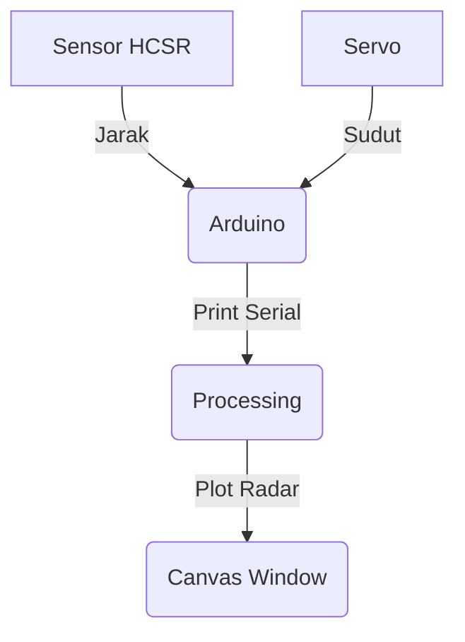

# Sistem Pemetaan 2D berbasis Arduino Uno dengan HCSR-04 menggunakan Processing

> [!NOTE]
> Project sederhana untuk melakukan pemetaan 2D.

## Daftar ISI
- Alat dan Bahan
- Cara Kerja
- Hardware
- Program
- Referensi

## Flow Chart

<div align="center">
  <br/>
  <a href="https://www.mermaidchart.com/raw/83dc95ff-548c-4e1b-be9f-32cad139033e?theme=light&version=v0.1&format=svg">
    
  </a>
  <br/>
</div>

## Cara Kerja

    



* Output 

Test di P5JS Web Live Editor https://editor.p5js.org/fillahall/sketches/RXj1kirjl


## Kode Arduino
    
```c++
#include <Servo.h> 

// Defines Trig and Echo pins of the Ultrasonic Sensor
const int trigPin = 10;
const int echoPin = 11;
const int servoPin = 12;
// Variables for the duration and the distance
long duration;
int distance;

Servo myServo; // Creates a servo object for controlling the servo motor

void setup() {
  Serial.begin(9600);
  pinMode(trigPin, OUTPUT); // Sets the trigPin as an Output
  pinMode(echoPin, INPUT); // Sets the echoPin as an Input
  myServo.attach(servoPin); // Defines on which pin is the servo motor attached
}
void loop() {
  for(int i=15;i<=165;i++){ // rotates the servo motor from 15 to 165 degrees
    myServo.write(i);
    delay(30);
    distance = calculateDistance(); // Calls a function for calculating the distance measured by the Ultrasonic sensor for each degree
    Serial.print(i);Serial.print(",");Serial.println(distance);
  }
  for(int i=165;i>15;i--){  // Repeats the previous lines from 165 to 15 degrees
    myServo.write(i);
    delay(30);
    distance = calculateDistance();
    Serial.print(i);Serial.print(",");Serial.println(distance);
  }
}
// Function for calculating the distance measured by the Ultrasonic sensor
int calculateDistance(){ 
  digitalWrite(trigPin, LOW); 
  delayMicroseconds(2);
  digitalWrite(trigPin, HIGH);  // Sets the trigPin on HIGH state for 10 micro seconds
  delayMicroseconds(10);
  digitalWrite(trigPin, LOW);
  duration = pulseIn(echoPin, HIGH); // Reads the echoPin, returns the sound wave travel time in microseconds
  distance = duration*0.034/2;
  return distance;
}
```


## Kode Processing

    
### Header
```java
import processing.serial.*; // imports library for serial communication
import java.awt.event.KeyEvent; // imports library for reading the data from the serial port
import java.io.IOException;
```

### Variabel
```java
Serial myPort; // defines Object Serial

// defines variables
String angle="";
String distance="";
String data="";
String noObject;
float pixsDistance;
int iAngle, iDistance;
int index1=0;
int index2=0;

String[] parts;
PFont orcFont;
```
### Fungsi ```setup()```
```java
void setup() {
 size (1200, 700); // ***CHANGE THIS TO YOUR SCREEN RESOLUTION***
 smooth();
 String portName = Serial.list()[0]; //change the 0 to a 1 or 2 etc. to match your port
 myPort = new Serial(this,portName, 9600); // ****CHANGE THE COM3 To the PORT YOUR ARDUINO IS ON!!!!****
 println(myPort);
 myPort.bufferUntil('\n'); // reads the data from the serial port up to the character '.'. So actually it reads this: angle,distance.
}
```
### Fungsi ```draw()```
```java


### Fungsi ```drawText()```
```java
void drawText() { // draws the texts on the screen
  
  pushMatrix();
  if(iDistance>40) {
  noObject = "Out of Range";
  }
  else {
  noObject = "In Range";
  }
  fill(0,0,0);
  noStroke();
  rect(0, height-height*0.0648, width, height);
  fill(98,245,31);
  textSize(25);
  
  text("10cm",width-width*0.3854,height-height*0.0833);
  text("20cm",width-width*0.281,height-height*0.0833);
  text("30cm",width-width*0.177,height-height*0.0833);
  text("40cm",width-width*0.0729,height-height*0.0833);
  textSize(40);
  text("Arduino Radar", width-width*0.975, height-height*0.0277);
  text("Angle: " + iAngle +" °", width-width*0.68, height-height*0.0277);
  text("Distance: ", width-width*0.36, height-height*0.0277);
  if(iDistance<40) {
  text("        " + iDistance +" cm", width-width*0.26, height-height*0.0277);
  }
  textSize(25);
  fill(98,245,60);
  translate((width-width*0.4994)+width/2*cos(radians(30)),(height-height*0.0907)-width/2*sin(radians(30)));
  rotate(-radians(-60));
  text("30°",0,0);
  resetMatrix();
  translate((width-width*0.503)+width/2*cos(radians(60)),(height-height*0.0888)-width/2*sin(radians(60)));
  rotate(-radians(-30));
  text("60°",0,0);
  resetMatrix();
  translate((width-width*0.507)+width/2*cos(radians(90)),(height-height*0.0833)-width/2*sin(radians(90)));
  rotate(radians(0));
  text("90°",0,0);
  resetMatrix();
  translate(width-width*0.513+width/2*cos(radians(120)),(height-height*0.07129)-width/2*sin(radians(120)));
  rotate(radians(-30));
  text("120°",0,0);
  resetMatrix();
  translate((width-width*0.5104)+width/2*cos(radians(150)),(height-height*0.0574)-width/2*sin(radians(150)));
  rotate(radians(-60));
  text("150°",0,0);
  popMatrix(); 
}
```


